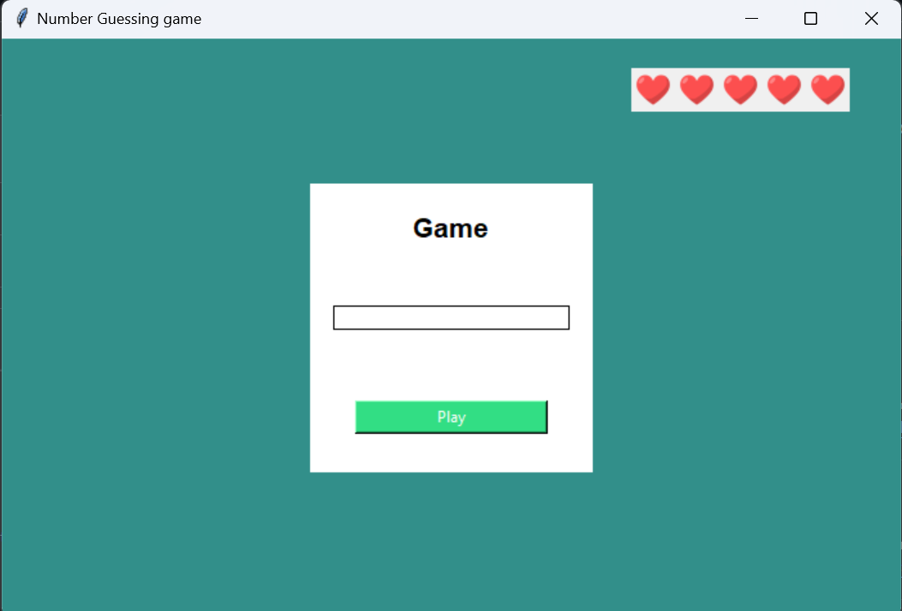

# Number Guessing Game

The Number Guessing Game is a simple Python game built using Tkinter for the graphical user interface. The game generates a random number, and the player has to guess the correct number within a limited number of attempts. Visual indicators (hearts) are used to represent the remaining attempts, and feedback messages are displayed in pop-ups.
## Table of contents

- [Overview](#overview)
- [features](#features) 
- [How to play](#how-to-play)
- [Installing and running the game](#installing-and-runing-with)
    - [Dependencies](#dependencies)
    - [Setup Instructions](#setup-instructions)
- [File structure](#file-structure)
- [How it work](#how-it-work)
- [How to reset the score](#how-reset-the-score)
- [Customization](#customization)
- [Contribution](#contribution)
- [Requirement](#requirment)
- [Licence](#licence)

## Overview



## Features
* Random number generation for each game session.

* User input field for guessing the number.

* Feedback pop-ups indicating whether the guess is too high, too low, or correct.

* Visual representation of remaining attempts using heart icons.

* The game resets after exhausting all attempts.

* Responsive UI with a centered input field and an interactive button.

* The window is centered on the screen upon launch.

## How to play

1. Launch the game by running the Python script.

2. Enter a number between 1 and 100 in the input field  

3. Submit your guess by pressing `Enter` or click the Play button.

3. If incorrect, a pop-up will indicate whether your guess is too high or too low.

4. Receive feedback:

    * A pop-up message will indicate whether your guess is too high or too low.

    * If the guess is correct, a pop-up will congratulate you.

    * A heart icon will disappear after every incorrect guess.

5. You have a total of 5 attempts before the game resets.

## Installing and running the game

### Dependencies
* Python (>=3.6)
* `tkinter` (build-in python)
* `Pillow` (for handling image)

### Setup installation
1. Clone the repository: 
```bash 
git clone <repository_url>
```
2. Navigate to the project folder
```bash
cd Number-Guessing-Game
```
3. Install dependencies
```bash
pip install -r requirement.txt
```
4. Run the game
```bash
python game.py
```

## File structure
```
Number-Guessing-Game/
├── README.md
├── main.py
├── preview.png
├── assets/
│   ├── heart.png
│   └── information.py
└── requirements.txt
```

## Features

| Feature                           | Description                              |
|-----------------------------------|------------------------------------------|
| Random Number Generation          |Each game session starts with a new random number.|
| User Input Field                   |The player enters a guess using the input field.
Feedback System|Pop-up messages inform the player if their guess is too high, too low, or correct.|
| Life Indicator                     | Heart icons represent remaining attempts.|
| Score Reset Functionality          |Resets the score display after the game ends.|
| Auto-centering Window              |The window is automatically positioned at the center of the screen upon startup.|

## How to Reset the Score Frame

To reset the score frame after each game, modify the init_game function by clearing and restoring the heart icons:
```python
 def reset_score_frame():
     global labels
     for label in labels:
         label.destroy()
     labels.clear()
     for _ in range(5):
         label = Label(frame, image=logo)
         label.pack(side='right')
         labels.append(label)
```
Then, call this function inside init_game():
```python
def init_game():
     global trial, nb, labels
     trial = 5 
     nb = random.randint(1, 100)
     reset_score_frame()
```
## contribution
We welcome contributions! Feel free to fork this repository and submit pull requests with your improvements.

Happy coding! 🎮
